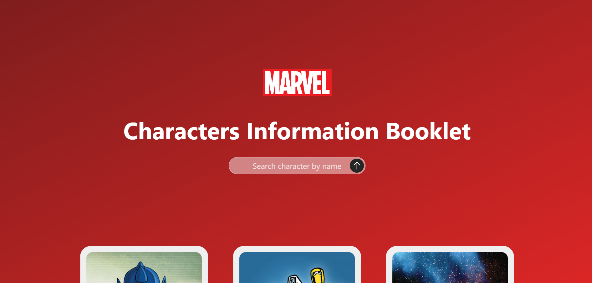
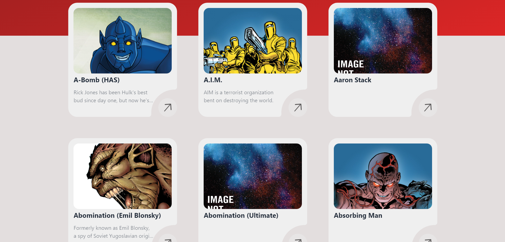

# Marvel Characters Explorer

Welcome to **Marvel Characters Explorer**, a web application that lets you explore the vast world of Marvel characters. This app leverages the [Marvel API](https://developer.marvel.com/) to display characters in a responsive grid layout, allows users to search for specific characters, and shows detailed information about each character when clicked.

## Features

- **Character Grid**: View a grid of Marvel characters with image and name.
- **Search Functionality**: Easily search for your favorite characters.
- **Character Details**: Click on any character card to view their brief information.
- **Responsive Design**: Works seamlessly across different devices and screen sizes.

## Screenshots






## Tech Stack

- **Frontend**: HTML, CSS, JavaScript
- **API**: Marvel API
- **Frontend**: React.js (Vite)
- **API**: Marvel API
- **Styling**: Tailwind CSS 

## How to Run

1. Clone the repository:

   ```bash
   git clone https://github.com/ateendra24/marvel-characters-explorer.git

2. Install the dependencies:

   ```bash
   npm install

3. Create a .env file in the root directory and add your Marvel API keys:

   ```bash
   VITE_MARVEL_PUBLICKEY=your_public_key
   VITE_MARVEL_PRIVATEKEY=your_private_key

4. Start the development server:

   ```bash
   npm run dev
   ```

 5. Open http://localhost:5173 in your browser to view the app.

 ## Marvel API

 This project uses the Marvel API to fetch data about Marvel characters. You will need to create an account with Marvel and generate your own API keys.


## Contact
If you have any questions or suggestions regarding the project, feel free to reach out!

Enjoy exploring the Marvel universe!

